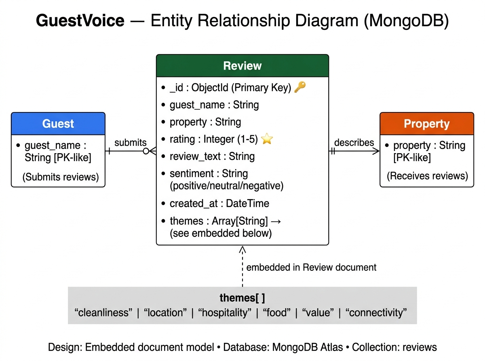

# GuestVoice 🏡

AI-powered guest review analysis platform for homestay businesses. Classifies sentiment, detects themes, and generates suggested management responses.

---

## Tech Stack

| Layer | Technology |
|-------|-----------|
| Frontend | React + Vite + Tailwind CSS |
| Backend | Python + FastAPI |
| Database | MongoDB Atlas (Motor async driver) |
| Styling | Tailwind CSS v3 |
| State | React Context API |

---

## Database — Why MongoDB?

GuestVoice uses **MongoDB Atlas** (free M0 tier) for the following reasons:

- Reviews are **document-based** — each review is a self-contained object with no relationships needed
- The `themes` field is an **array of strings** — MongoDB handles arrays natively as first-class citizens
- **Flexible schema** — future AI fields (e.g. `ai_response`, `ai_analysis`) can be added without migrations
- **Motor** (async MongoDB driver) integrates seamlessly with FastAPI's async architecture
- Built-in **text search** and **aggregation** fit our search and stats endpoints perfectly

---

## Database Schema

### Collection: `reviews`



| Field | Type | Description |
|-------|------|-------------|
| `_id` | ObjectId | Auto-generated primary key by MongoDB |
| `guest_name` | String | Full name of the guest |
| `property` | String | Homestay/property name |
| `rating` | Integer (1–5) | Star rating given by the guest |
| `review_text` | String | The full review text |
| `sentiment` | String | Auto-assigned: positive / neutral / negative |
| `themes` | Array[String] | Detected themes: cleanliness, location, etc. |
| `created_at` | DateTime | Timestamp of submission |

> Single collection design — no relationships or joins needed.

---

## How to Run Frontend Locally

```bash
# Install dependencies
npm install

# Start dev server
npm run dev
```

Frontend runs at: **http://localhost:5173**

---

## How to Run Backend Locally

### 1. Navigate to the backend folder
```bash
cd backend
```

### 2. Create a Python virtual environment
```bash
python3 -m venv venv
```

### 3. Activate the virtual environment
```bash
# macOS / Linux
source venv/bin/activate

# Windows
venv\Scripts\activate
```

### 4. Install dependencies
```bash
pip install -r requirements.txt
```

### 5. Set up environment variables
```bash
cp .env.example .env
# Then edit .env and add your MONGO_URI from MongoDB Atlas
```

### 6. Set up MongoDB Atlas (Free)
1. Go to [mongodb.com/cloud/atlas](https://www.mongodb.com/cloud/atlas) → Sign up free
2. Create a free **M0 cluster**
3. Create a **database user** (username + password)
4. Whitelist your IP → "Add My Current IP Address"
5. Click **Connect → Drivers → Python** → copy the connection string
6. Add `/guestvoice` before the `?` in the URI
7. Paste into your `.env` file as `MONGO_URI=...`

### 7. Start the backend server
```bash
uvicorn main:app --reload --port 8000
```

Backend runs at: **http://localhost:8000**

Interactive API docs: **http://localhost:8000/docs**

---

## API Endpoints

| Method | Endpoint | Description |
|--------|----------|-------------|
| GET | `/api/reviews` | List all reviews |
| GET | `/api/reviews/{id}` | Get single review |
| POST | `/api/reviews` | Submit new review |
| PUT | `/api/reviews/{id}` | Update a review |
| DELETE | `/api/reviews/{id}` | Delete a review |
| GET | `/api/reviews/search?q=keyword` | Search reviews |
| GET | `/api/stats` | Get review statistics |

---

## Project Structure

```
GuestVoice/
├── backend/
│   ├── main.py                        # FastAPI entry point + lifespan
│   ├── database.py                    # MongoDB Motor connection + seeding
│   ├── requirements.txt               # Python dependencies
│   ├── .env.example                   # Environment variable template
│   ├── W5_SchemaDiagram_TBI-26101147.jpg  # Database schema diagram
│   ├── models/
│   │   └── review.py                  # Pydantic schemas
│   └── routes/
│       └── reviews.py                 # API route handlers (async + MongoDB)
├── src/
│   ├── components/
│   │   └── ui/                        # Reusable component library
│   ├── context/                       # React Context (ThemeContext)
│   └── pages/                         # App pages
└── README.md
```

---

## Intern Details

- **Name:** Aryan Butola
- **Intern ID:** TBI-26101147
- **Program:** The Bridge Internship — GEU
