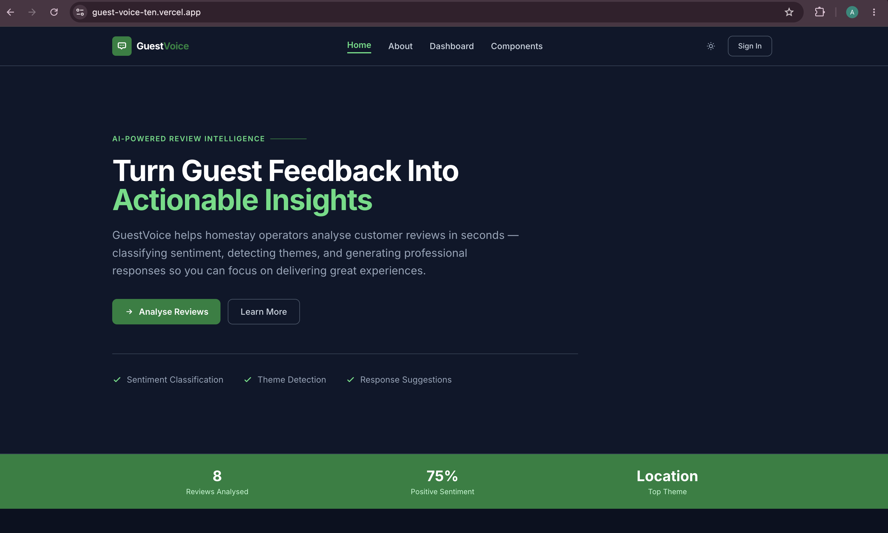
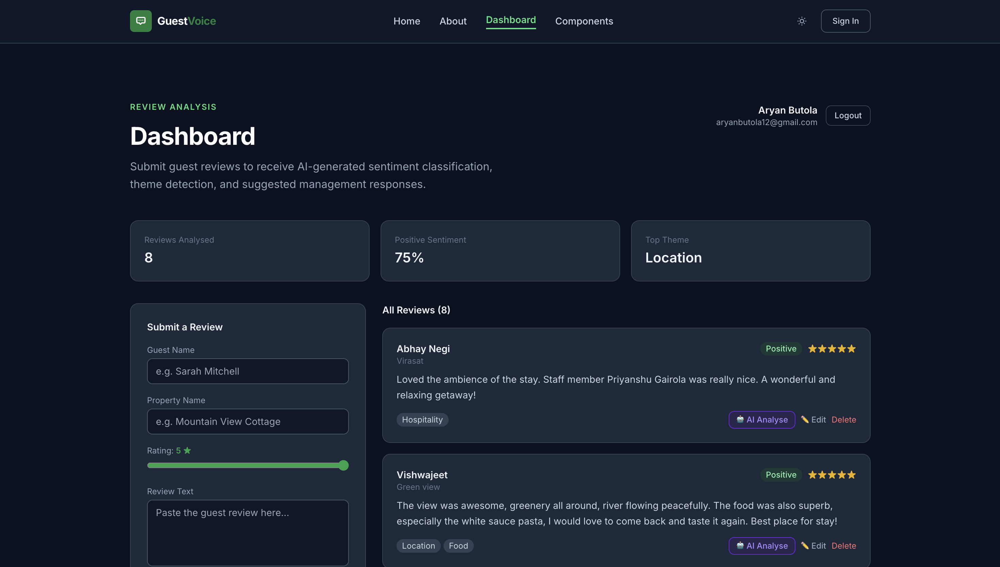
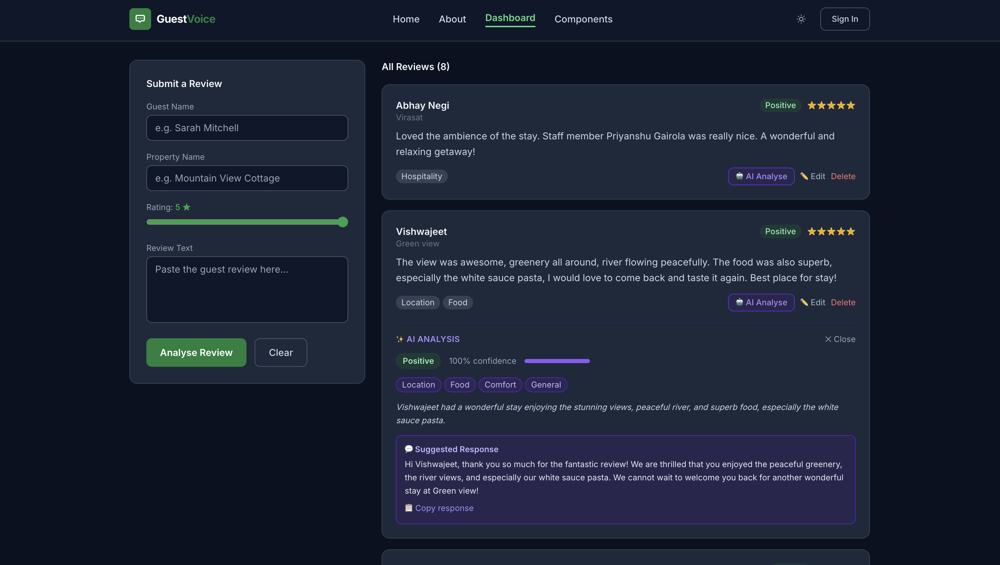
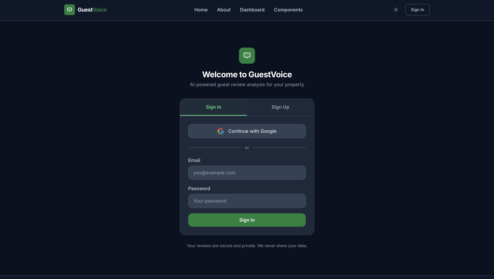

# GuestVoice 🏡
### AI-powered guest review analysis platform for homestay operators

GuestVoice helps property managers understand and respond to guest reviews at scale — using Google Gemini AI to classify sentiment, detect themes, and generate professional management responses.

---

## 🌐 Live Demo

**👉 [https://guest-voice-ten.vercel.app](https://guest-voice-ten.vercel.app)**

| Service | URL |
|---------|-----|
| Frontend (Vercel) | https://guest-voice-ten.vercel.app |
| Backend API (Render) | https://guestvoice-api.onrender.com |
| API Docs (Swagger) | https://guestvoice-api.onrender.com/docs |
| GitHub Repo | https://github.com/AryanButola10/GuestVoice |

> ⚠️ **Free tier note:** Render spins down after 15 minutes of inactivity. The first request after idle may take 30–60 seconds to wake up.

---

## 🎬 Demo Video

**👉 [Watch Demo on YouTube](https://youtu.be/rVSlJf6L-gk)**

---

## 📸 Screenshots

| Home Page | Dashboard |
|-----------|-----------|
|  |  |

| AI Analysis | Login |
|-------------|-------|
|  |  |

---

## ✨ Features

- 📊 **Review Dashboard** — View, create, edit, and delete guest reviews with real-time statistics
- 🤖 **AI Analysis** — Google Gemini-powered sentiment classification, theme detection, and suggested management responses
- 🔒 **JWT Authentication** — Secure register/login with bcrypt password hashing
- 🔑 **Google OAuth 2.0** — One-click sign-in with Google
- 📈 **Live Statistics** — Total reviews, positive/negative percentages, average rating, top theme
- 🔍 **Search** — Full-text search across reviews
- 🌗 **Dark / Light Mode** — System-aware theme toggle
- 📱 **Fully Responsive** — Works on mobile (375px), tablet, and desktop (1440px)
- ⚡ **Rate Limiting** — Protection against brute-force on auth endpoints
- 🛡️ **Error Boundary** — Graceful fallback UI for unexpected crashes

---

## 🛠 Tech Stack

| Layer | Technology |
|-------|-----------|
| **Frontend** | React 19, Vite 8, Tailwind CSS v3 |
| **Backend** | Python 3.11, FastAPI, Uvicorn |
| **Database** | MongoDB Atlas (Motor async driver) |
| **AI** | Google Gemini 1.5 Flash API |
| **Authentication** | JWT (python-jose) + Google OAuth 2.0 (Authlib) |
| **Frontend Deploy** | Vercel |
| **Backend Deploy** | Render |
| **State Management** | React Context API |
| **HTTP Client** | httpx (backend), fetch (frontend) |

---

## ⚙️ Local Setup

### Prerequisites
- Node.js 18+
- Python 3.11+
- A MongoDB Atlas account (free M0 tier)
- A Google Cloud project with OAuth 2.0 credentials
- A Google Gemini API key (from [aistudio.google.com](https://aistudio.google.com))

---

### 1. Clone the repository
```bash
git clone https://github.com/AryanButola10/GuestVoice.git
cd GuestVoice
```

### 2. Backend setup
```bash
cd backend
python3 -m venv venv
source venv/bin/activate        # Windows: venv\Scripts\activate
pip install -r requirements.txt
cp .env.example .env
```

Edit `backend/.env` and fill in your values:
```env
PORT=8000
MONGO_URI=mongodb+srv://<username>:<password>@cluster0.xxxxx.mongodb.net/guestvoice
JWT_SECRET=your_long_random_secret_key
JWT_ALGORITHM=HS256
JWT_EXPIRE_DAYS=7
GOOGLE_CLIENT_ID=your_google_oauth_client_id.apps.googleusercontent.com
GOOGLE_CLIENT_SECRET=GOCSPX-your_secret
FRONTEND_URL=http://localhost:5173
BACKEND_URL=http://localhost:8000
GEMINI_API_KEY=your_gemini_api_key
```

Start the backend:
```bash
uvicorn main:app --port 8000
```
✅ API running at: `http://localhost:8000`
✅ Swagger docs at: `http://localhost:8000/docs`

---

### 3. Frontend setup
```bash
# From the project root
cp .env.example .env
```

Edit `.env`:
```env
VITE_API_URL=http://localhost:8000/api
```

Install and run:
```bash
npm install
npm run dev
```
✅ Frontend running at: `http://localhost:5173`

---

## 📡 API Documentation

Base URL: `https://guestvoice-api.onrender.com`

### Reviews

#### `GET /api/reviews` — Get all reviews
```json
// Response 200
[
  {
    "id": "64abc123...",
    "guest_name": "Rahul Sharma",
    "property": "Mountain View Cottage",
    "rating": 5,
    "review_text": "Loved the view and the hospitality!",
    "sentiment": "positive",
    "themes": ["location", "hospitality"],
    "created_at": "2025-07-01T10:30:00"
  }
]
```

#### `POST /api/reviews` — Create a review *(requires JWT)*
```json
// Request body
{
  "guest_name": "Priya Singh",
  "property": "Hilltop Haven",
  "rating": 4,
  "review_text": "Beautiful place, food was amazing!",
  "themes": ["food", "location"]
}

// Response 201
{ "id": "64abc456...", "sentiment": "positive", ... }
```

#### `PUT /api/reviews/{id}` — Update a review *(requires JWT)*
```json
// Request body (all fields optional)
{ "rating": 5, "review_text": "Updated review text" }

// Response 200
{ "id": "64abc456...", "rating": 5, ... }
```

#### `DELETE /api/reviews/{id}` — Delete a review *(requires JWT)*
```json
// Response 200
{ "message": "Review deleted successfully" }
```

#### `GET /api/reviews/search?q=keyword` — Search reviews
```json
// Response 200
[ { "id": "...", "guest_name": "...", ... } ]
```

#### `GET /api/stats` — Get review statistics
```json
// Response 200
{
  "total_reviews": 8,
  "positive_percent": 75,
  "neutral_percent": 12,
  "negative_percent": 12,
  "top_theme": "location",
  "average_rating": 4.1
}
```

---

### Authentication

#### `POST /api/auth/register` — Register a new user
```json
// Request body
{
  "name": "Aryan Butola",
  "email": "aryan@example.com",
  "password": "securepassword123"
}

// Response 201
{
  "access_token": "eyJhbGci...",
  "token_type": "bearer",
  "user": { "id": "...", "name": "Aryan Butola", "email": "aryan@example.com" }
}
```

#### `POST /api/auth/login` — Login
```json
// Request body
{ "email": "aryan@example.com", "password": "securepassword123" }

// Response 200
{ "access_token": "eyJhbGci...", "token_type": "bearer", "user": { ... } }
```

#### `GET /api/auth/me` — Get current user *(requires JWT)*
```json
// Response 200
{ "id": "...", "name": "Aryan Butola", "email": "aryan@example.com", "provider": "local" }
```

#### `GET /api/auth/google` — Initiate Google OAuth
Redirects browser to Google consent screen.

#### `GET /api/auth/google/callback` — OAuth callback
Exchanges code for JWT, redirects to frontend with token.

---

### AI Analysis

#### `POST /api/ai/analyze` — Analyse a review with Gemini AI *(requires JWT)*
```json
// Request body
{
  "review_text": "The location was amazing but the room was a bit dusty.",
  "guest_name": "Simran Rana",
  "property_name": "Ganga Stays",
  "rating": 3
}

// Response 200
{
  "sentiment": "Neutral",
  "themes": ["Location", "Cleanliness"],
  "suggested_response": "Dear Simran, thank you for your feedback..."
}
```

---

## 🗂 Architecture & Folder Structure

```
GuestVoice/
│
├── backend/                        # FastAPI backend
│   ├── main.py                     # App entry point, middleware, routers
│   ├── database.py                 # MongoDB connection + seed data
│   ├── requirements.txt            # Python dependencies
│   ├── .env.example                # Environment variable template
│   ├── auth/
│   │   ├── dependencies.py         # JWT auth middleware (get_current_user)
│   │   └── jwt_handler.py          # Token creation and decoding
│   ├── models/
│   │   ├── review.py               # Pydantic schemas for reviews
│   │   └── user.py                 # Pydantic schemas for users
│   └── routes/
│       ├── reviews.py              # CRUD endpoints for reviews
│       ├── auth.py                 # Register, login, Google OAuth
│       └── ai.py                   # Gemini AI analysis endpoint
│
├── src/                            # React frontend
│   ├── main.jsx                    # App entry point + ErrorBoundary
│   ├── App.jsx                     # Routes (BrowserRouter)
│   ├── index.css                   # Global styles + Tailwind
│   ├── components/
│   │   ├── ui/                     # Reusable UI: Button, Input, Loader, Modal, Toast
│   │   ├── Navbar.jsx
│   │   ├── Hero.jsx
│   │   ├── Card.jsx
│   │   ├── Footer.jsx
│   │   ├── ErrorBoundary.jsx       # React class-based error boundary
│   │   └── ProtectedRoute.jsx      # Route guard (redirects to /login)
│   ├── context/
│   │   ├── AuthContext.jsx         # Global auth state + JWT localStorage
│   │   └── ThemeContext.jsx        # Dark/Light mode toggle
│   └── pages/
│       ├── Home.jsx                # Landing page with live stats
│       ├── Dashboard.jsx           # Review management (full CRUD + AI)
│       ├── Login.jsx               # Register/Login + Google OAuth
│       ├── About.jsx               # About page
│       ├── Showcase.jsx            # Component showcase
│       └── AuthCallback.jsx        # OAuth redirect handler
│
├── screenshots/                    # README screenshots
├── public/                         # Static assets
├── .env.example                    # Frontend env template
├── vercel.json                     # Vercel SPA routing config
├── vite.config.js                  # Vite + custom SPA fallback plugin
├── tailwind.config.js
└── package.json
```

### Key Design Decisions

| Decision | Reasoning |
|----------|-----------|
| **MongoDB over SQL** | Reviews are documents — no relationships needed; arrays (themes) are first-class |
| **FastAPI over Express** | Async I/O matches Motor's async MongoDB driver; auto Swagger docs |
| **JWT + localStorage** | Simple, stateless; no session server required for this scale |
| **Gemini Flash model** | Fastest Gemini model; low latency for real-time review analysis |
| **Vite 8 + React 19** | Latest ecosystem; HMR, SPA plugin, fastest dev experience |

---

## ⚠️ Known Limitations

| Limitation | Details |
|------------|---------|
| **Render cold start** | Free tier sleeps after 15 min inactivity; first request takes 30–60 sec |
| **Gemini rate limits** | Free tier: 15 requests/min. Analysing many reviews quickly may hit limit |
| **MongoDB Atlas M0** | 512 MB storage cap; shared cluster — performance varies under load |
| **No image uploads** | Property photos not supported in current version |
| **No pagination** | All reviews fetched at once; may slow down with 100+ reviews |
| **Single-user dashboard** | All authenticated users see all reviews; no per-property access control |

---

## 🙏 Credits & Acknowledgements

| Tool / Resource | Usage |
|----------------|-------|
| **Google Gemini AI** | AI-powered sentiment analysis and response generation |
| **Antigravity (Google DeepMind)** | AI coding assistant used throughout development |
| **MongoDB Atlas** | Free hosted database |
| **Render** | Free backend hosting |
| **Vercel** | Free frontend hosting |
| **Authlib** | Google OAuth 2.0 integration |
| **Tailwind CSS** | Utility-first styling |
| **FastAPI** | High-performance Python web framework |
| **The Bridge Internship — GEU** | Program structure and mentorship |

---

## 👨‍💻 Intern Details

| | |
|-|-|
| **Name** | Aryan Butola |
| **Intern ID** | TBI-26101147 |
| **Program** | The Bridge Internship — Graphic Era University |
| **Duration** | June – August 2026 |
